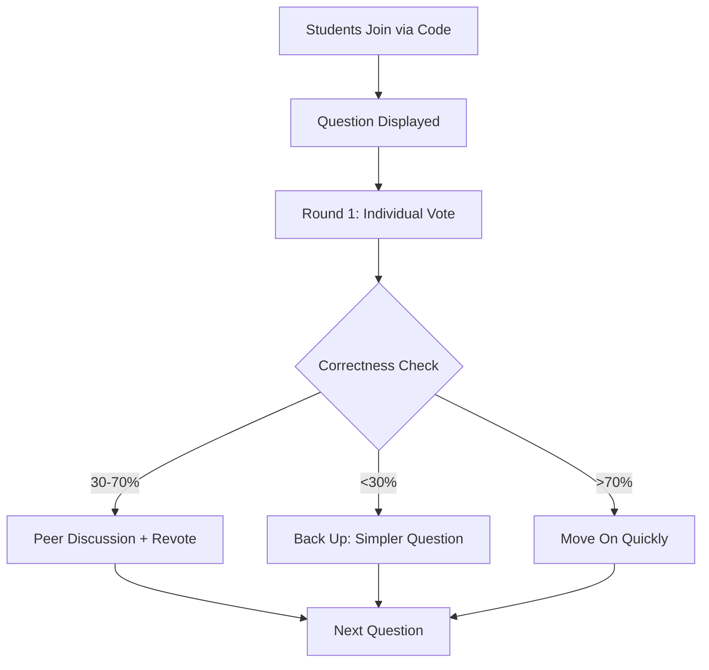

# 📋 Product Specifications

## Project Name
**Quizly** — Autonomous Peer-Instruction Quiz Host

---

## Problem Statement

Traditional classrooms and basic quiz tools provide limited real-time visibility into what students actually understand. Instructors must:
- Manually design questions
- Decide when to trigger discussion  
- Interpret noisy polling data

This makes it hard to adapt instruction on the fly or ensure each student leaves with at least one concrete learning gain.

---

## Solution Overview

Quizly is an AI quizmaster that, given a structured description of a topic and syllabus, autonomously:

1. **Generates** Mazur/MIT-style conceptual questions targeting common misconceptions
2. **Runs live polling** (first vote → discussion → revote) with research-based thresholds (30-70% correct)
3. **Analyzes** answer distributions, confidence, and rationales to compute "class pulse"
4. **Adapts** questions for individuals (remedial or stretch) and reallocates time across concepts
5. **Produces** exit tickets targeting each student's weakest concept

---

## Target Users

| User Type | Description |
|-----------|-------------|
| **Instructors** | University and advanced high-school instructors using active learning / TEAL-style formats |
| **TAs / Study Leaders** | Teaching assistants or study-group leaders wanting structured, discussion-centric sessions |

---

## Key User Flows

### 1. Instructor Setup (Before Class)

**Input:** JSON "mini-syllabus" with topic, concepts, difficulty curve, and time budget  
**Output:** Session plan with question sequence, predicted discussion slots, and estimated pacing

### 2. Live Session (During Class)

**For each question:**
- Round 1: Individual vote + optional confidence + one-line rationale
- Quizly computes correctness %, entropy, and misconception patterns
- Adaptive response based on class performance

### 3. Follow-Up (End / After Class)

| Recipient | Deliverable |
|-----------|-------------|
| **Students** | Short "exit ticket" micro-lesson + personalized question on weakest concept |
| **Instructor** | Report with per-concept mastery, sample rationales, and recommendations |

---

## Core Features (v1)

| Feature | Description |
|---------|-------------|
| 📝 JSON Session Generator | Create sessions from structured syllabus input |
| 🔴 Live Quiz Orchestration | Real-time WebSocket-based polling and voting |
| 📊 Per-Student Tracking | Concept mastery tracking and adaptive follow-ups |
| 📈 Class Pulse Analytics | Correctness, confidence, misconception clusters |
| 💬 AI Discussion Prompts | Auto-generated prompts encouraging peer explanation |
| 📤 Exportable Reports | PDF/JSON reports for instructors and students |

---

## Non-Goals (v1)

| Excluded | Reason |
|----------|--------|
| Full LMS Replacement | Focus on active learning, not course management |
| Gradebook Integration | Prioritize session flow over grading workflows |
| High-Stakes Exam Security | Not designed for proctored assessments |

---

## Success Metrics

| Metric | Target |
|--------|--------|
| Question generation quality | >85% rated "conceptually sound" by educators |
| Adaptive policy accuracy | Match best-practice heuristics from clicker research |
| Student engagement | >90% participation rate in exit tickets |
| Learning gain | Measurable normalized gain in post-session assessments |
