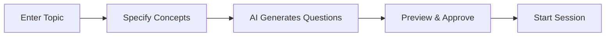
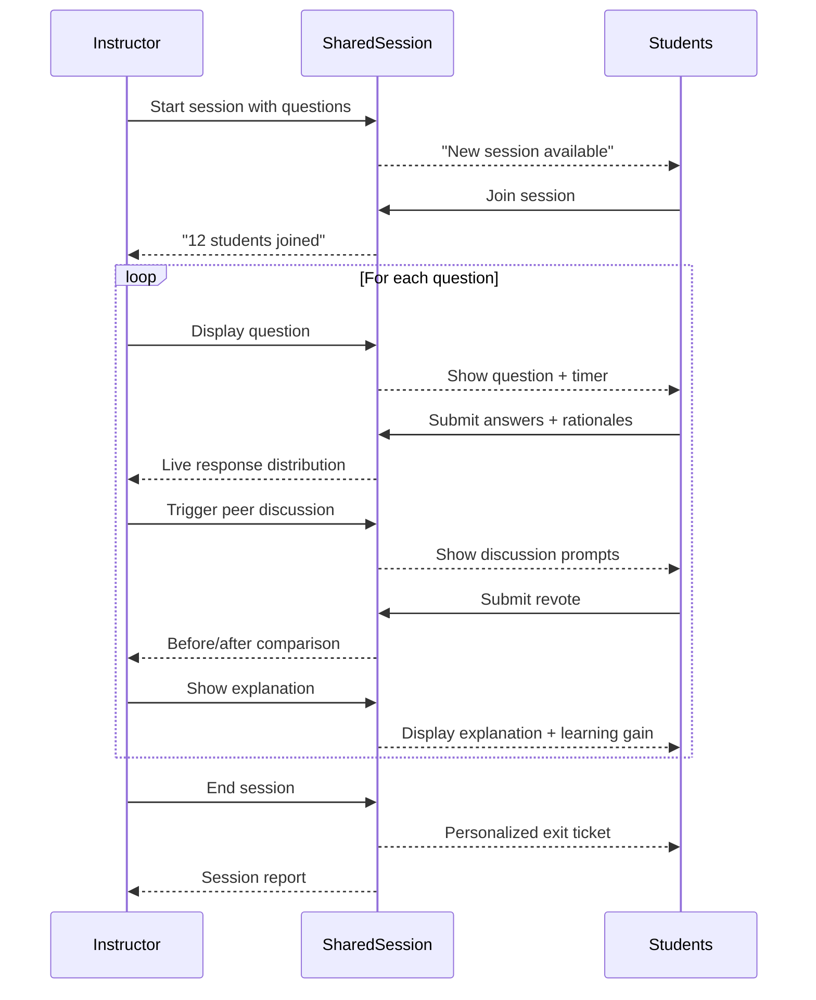

# 👥 User Experience Flows

## Overview

Quizly provides two distinct but synchronized experiences:

| User | Interface | Key Actions |
|------|-----------|-------------|
| **Instructor** | Teacher Dashboard (port 7872) | Create sessions, monitor responses, decide actions |
| **Student** | Student Experience (port 7871) | Join session, answer questions, participate in discussions |

---

## 🎓 Instructor Experience

### Phase 1: Session Setup



**What Instructor Sees:**

```
┌─────────────────────────────────────────────────────────────┐
│  📋 Session Setup                                           │
├─────────────────────────────────────────────────────────────┤
│                                                             │
│  Topic:    [Predicates, Sets, and Proofs          ]        │
│                                                             │
│  Concepts: [predicate logic, set operations, proofs]       │
│                                                             │
│  Questions: [4] ────●───────                                │
│                                                             │
│  [🚀 Generate Session]                                      │
│                                                             │
├─────────────────────────────────────────────────────────────┤
│  📝 Generated Questions (AI-Powered)                        │
│                                                             │
│  Q1 (40%): Which is the NEGATION of '∀x ∃y P(x,y)'?        │
│  Q2 (55%): If A = {1,2,3} and B = {2,3,4}, what is A ∩ B?  │
│  Q3 (70%): Best proof technique for "n² even → n even"?    │
│  Q4 (85%): English translation of ∀x ∃y (y > x)?           │
│                                                             │
│  ✅ Session ready - Share code: QUIZ-7872                   │
└─────────────────────────────────────────────────────────────┘
```

### Phase 2: Live Monitoring

**What Instructor Sees During Voting:**

```
┌─────────────────────────────────────────────────────────────┐
│  📊 Live Monitoring - Question 1 of 4                       │
├─────────────────────────────────────────────────────────────┤
│                                                             │
│  Question: Which is the NEGATION of '∀x ∃y P(x,y)'?        │
│                                                             │
│  ┌──────────────────────────────────────────────────────┐  │
│  │ Response Distribution (12 students)                   │  │
│  │                                                       │  │
│  │  A. ∃x ∀y ¬P(x,y)  ████████████████████ 58% (7)  ✅  │  │
│  │  B. ∀x ∀y ¬P(x,y)  ██████ 25% (3)                    │  │
│  │  C. ∃x ∃y ¬P(x,y)  ███ 17% (2)                       │  │
│  │  D. ¬∀x ∃y P(x,y)  0%                                │  │
│  └──────────────────────────────────────────────────────┘  │
│                                                             │
│  🤖 AI Recommendation: 🟡 PEER DISCUSSION                   │
│     "58% correct - perfect split for productive debate"    │
│                                                             │
│  [🗣️ Start Discussion] [📝 Show Explanation] [➡️ Skip]     │
│                                                             │
├─────────────────────────────────────────────────────────────┤
│  💬 Sample Rationales                                       │
│                                                             │
│  ✅ "Negate by flipping quantifiers: ∀→∃, ∃→∀, then ¬P"   │
│  ❌ "I thought you just add ¬ to the front"                │
│  ❌ "Both quantifiers become existential when negated"      │
└─────────────────────────────────────────────────────────────┘
```

### Phase 3: During Peer Discussion

```
┌─────────────────────────────────────────────────────────────┐
│  🗣️ Peer Discussion in Progress                            │
├─────────────────────────────────────────────────────────────┤
│                                                             │
│  ⏱️ Discussion Time: 2:34 remaining                        │
│                                                             │
│  💡 AI Discussion Prompts (shown to students):             │
│  • "If x=5, does ∃y P(5,y) need ALL y or just ONE?"        │
│  • "What's the difference between ∀y and ∃y in negation?" │
│                                                             │
│  📊 Live Revote Progress: 8/12 students revoted            │
│                                                             │
│  ┌────────────────────────────────┐                        │
│  │ Before → After                 │                        │
│  │   A: 58% → 75% (+17)          │                        │
│  │   B: 25% → 17% (-8)           │                        │
│  │   C: 17% → 8%  (-9)           │                        │
│  └────────────────────────────────┘                        │
│                                                             │
│  ✅ Learning Gain Detected: +17% moved to correct answer  │
│                                                             │
│  [⏹️ End Discussion] [⏰ Extend Time]                       │
└─────────────────────────────────────────────────────────────┘
```

### Phase 4: Session Summary

```
┌─────────────────────────────────────────────────────────────┐
│  📈 Session Summary                                         │
├─────────────────────────────────────────────────────────────┤
│                                                             │
│  Topic: Predicates, Sets, and Proofs                       │
│  Duration: 45 minutes | Students: 24                        │
│                                                             │
│  Question Results:                                          │
│  ┌────────────────────────────────────────────────────┐    │
│  │  Q1: Predicate Negation                            │    │
│  │      Initial: 58% → Final: 75%  📈 +17% gain       │    │
│  │      Action: PEER_DISCUSSION ✅                    │    │
│  │                                                    │    │
│  │  Q2: Set Intersection                              │    │
│  │      Initial: 92% → Final: 92%                     │    │
│  │      Action: MOVE_ON ✅                            │    │
│  │                                                    │    │
│  │  Q3: Proof Techniques                              │    │
│  │      Initial: 25% → Final: 67%  📈 +42% gain       │    │
│  │      Action: REMEDIATE → PEER_DISCUSSION           │    │
│  │                                                    │    │
│  │  Q4: Quantifier Translation                        │    │
│  │      Initial: 71% → Final: 88%  📈 +17% gain       │    │
│  │      Action: PEER_DISCUSSION ✅                    │    │
│  └────────────────────────────────────────────────────┘    │
│                                                             │
│  📊 Overall Learning Gain: +19% normalized gain            │
│                                                             │
│  Common Misconceptions Identified:                          │
│  • "Negation just adds ¬ to the front" (8 students)        │
│  • "Contrapositive = contradiction" (5 students)           │
│                                                             │
│  [📤 Export Report] [📧 Email to Students]                  │
└─────────────────────────────────────────────────────────────┘
```

---

## 📱 Student Experience

### Phase 1: Join Session

```
┌─────────────────────────────────────────────────────────────┐
│                                                             │
│               🎓 Welcome to Quizly                          │
│                                                             │
│         Enter the session code from your instructor         │
│                                                             │
│              ┌─────────────────────────┐                   │
│              │    QUIZ-7872            │                   │
│              └─────────────────────────┘                   │
│                                                             │
│              Your Name:                                     │
│              ┌─────────────────────────┐                   │
│              │    Alex                 │                   │
│              └─────────────────────────┘                   │
│                                                             │
│              [🚀 Join Session]                              │
│                                                             │
│         ────────────────────────────────                   │
│         Topic: Predicates, Sets, and Proofs                │
│         Instructor: Prof. Chen                              │
│                                                             │
└─────────────────────────────────────────────────────────────┘
```

### Phase 2: Answer Question (Round 1)

```
┌─────────────────────────────────────────────────────────────┐
│  Question 1 of 4                                    ⏱️ 1:45 │
├─────────────────────────────────────────────────────────────┤
│                                                             │
│  Which of the following is the NEGATION of '∀x ∃y P(x,y)'? │
│                                                             │
│  ┌─────────────────────────────────────────────────────┐   │
│  │ ○ A. ∃x ∀y ¬P(x,y)                                  │   │
│  ├─────────────────────────────────────────────────────┤   │
│  │ ○ B. ∀x ∀y ¬P(x,y)                                  │   │
│  ├─────────────────────────────────────────────────────┤   │
│  │ ● C. ∃x ∃y ¬P(x,y)        ← Selected               │   │
│  ├─────────────────────────────────────────────────────┤   │
│  │ ○ D. ¬∀x ∃y P(x,y)                                  │   │
│  └─────────────────────────────────────────────────────┘   │
│                                                             │
│  How confident are you?                                     │
│  Not sure ──────●───────────── Very sure                   │
│                 65%                                         │
│                                                             │
│  Brief rationale (optional):                                │
│  ┌─────────────────────────────────────────────────────┐   │
│  │ I think both quantifiers become ∃ when negated     │   │
│  └─────────────────────────────────────────────────────┘   │
│                                                             │
│  [✅ Submit Answer]                                         │
│                                                             │
└─────────────────────────────────────────────────────────────┘
```

### Phase 3: Peer Discussion

```
┌─────────────────────────────────────────────────────────────┐
│  🗣️ Peer Discussion Time!                           ⏱️ 3:00 │
├─────────────────────────────────────────────────────────────┤
│                                                             │
│  Your answer: C. ∃x ∃y ¬P(x,y)                             │
│                                                             │
│  📊 Class Split:                                            │
│     58% chose A  |  25% chose B  |  17% chose C            │
│                                                             │
│  ─────────────────────────────────────────────────────     │
│                                                             │
│  💬 Discussion Prompts:                                     │
│                                                             │
│  • Find someone who chose a DIFFERENT answer               │
│  • Ask them: "Why did you flip the quantifiers?"           │
│  • Consider: If x=5, does ∃y P(5,y) need ALL y or ONE?     │
│                                                             │
│  ─────────────────────────────────────────────────────     │
│                                                             │
│  After discussing, do you want to change your answer?      │
│                                                             │
│  [Keep C] [Change to A] [Change to B] [Change to D]        │
│                                                             │
└─────────────────────────────────────────────────────────────┘
```

### Phase 4: See Explanation

```
┌─────────────────────────────────────────────────────────────┐
│  ✅ Correct Answer: A                                       │
├─────────────────────────────────────────────────────────────┤
│                                                             │
│  Your answer: C → A (changed after discussion) ✅          │
│                                                             │
│  📖 Explanation:                                            │
│                                                             │
│  To negate a quantified statement:                          │
│  1. Flip each quantifier: ∀ → ∃ and ∃ → ∀                  │
│  2. Negate the predicate: P(x,y) → ¬P(x,y)                 │
│                                                             │
│  So ∀x ∃y P(x,y) becomes ∃x ∀y ¬P(x,y)                     │
│                                                             │
│  ⚠️ Common Mistake:                                         │
│  Many students think both quantifiers become ∃.             │
│  Remember: negation FLIPS them, not makes them the same!   │
│                                                             │
│  ─────────────────────────────────────────────────────     │
│                                                             │
│  📈 Class Performance:                                      │
│     Before discussion: 58% correct                          │
│     After discussion:  75% correct                          │
│     🎉 +17% learning gain through peer discussion!         │
│                                                             │
│  [➡️ Continue to Question 2]                                │
│                                                             │
└─────────────────────────────────────────────────────────────┘
```

### Phase 5: Exit Ticket (End of Session)

```
┌─────────────────────────────────────────────────────────────┐
│  📝 Your Personalized Exit Ticket                           │
├─────────────────────────────────────────────────────────────┤
│                                                             │
│  Great work today, Alex! Here's a quick review:             │
│                                                             │
│  ✅ Strengths:                                              │
│  • Set operations (100% correct)                            │
│  • Quantifier translation (correct after discussion)        │
│                                                             │
│  📚 Area to Review: Proof Techniques                        │
│                                                             │
│  You struggled with identifying the best proof technique.   │
│  Here's a quick refresher:                                  │
│                                                             │
│  ┌─────────────────────────────────────────────────────┐   │
│  │ DIRECT PROOF: Assume P, derive Q                    │   │
│  │ CONTRAPOSITIVE: Prove ¬Q → ¬P instead              │   │
│  │ CONTRADICTION: Assume ¬(P→Q), find contradiction   │   │
│  │ INDUCTION: Base case + inductive step              │   │
│  └─────────────────────────────────────────────────────┘   │
│                                                             │
│  🎯 One More Question:                                      │
│                                                             │
│  To prove "If n is odd, then n² is odd",                   │
│  which technique is most direct?                            │
│                                                             │
│  ○ A. Direct proof                                         │
│  ○ B. Contrapositive                                       │
│  ○ C. Contradiction                                        │
│  ○ D. Induction                                            │
│                                                             │
│  [Submit & Finish Session]                                  │
│                                                             │
└─────────────────────────────────────────────────────────────┘
```

---

## 🔄 Real-Time Synchronization



---

## 📱 Ports & URLs

| Interface | URL | Purpose |
|-----------|-----|---------|
| Teacher Dashboard | http://localhost:7872 | Instructor control panel |
| Student Experience | http://localhost:7871 | Student voting interface |
| Enhanced Simulation | http://localhost:7874 | AI student simulation |
| Visual Simulation | http://localhost:7873 | Quick demo mode |
